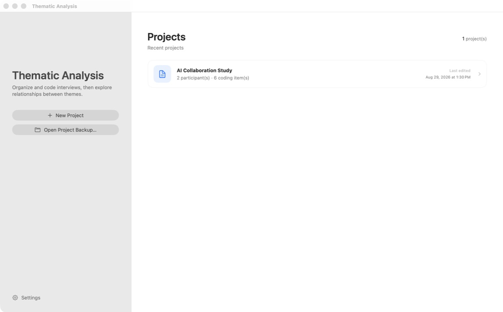
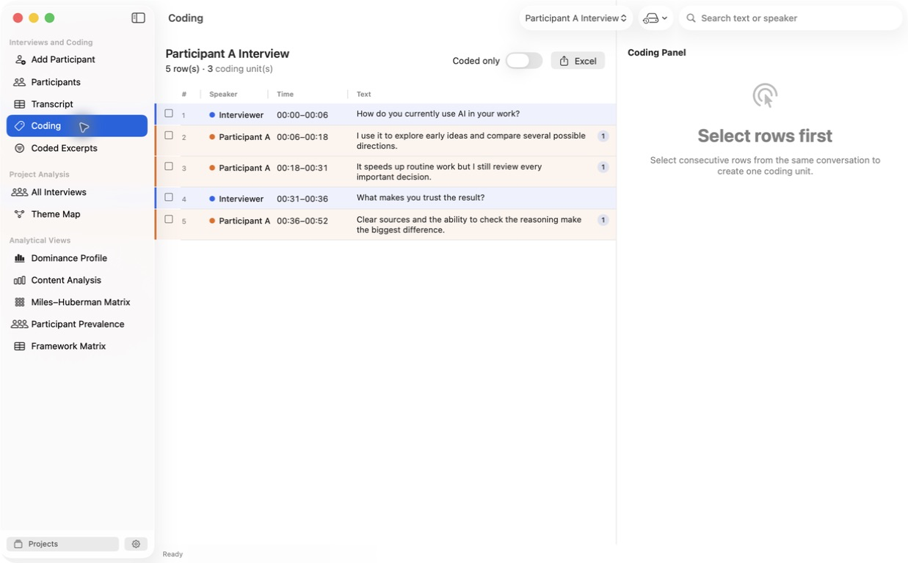
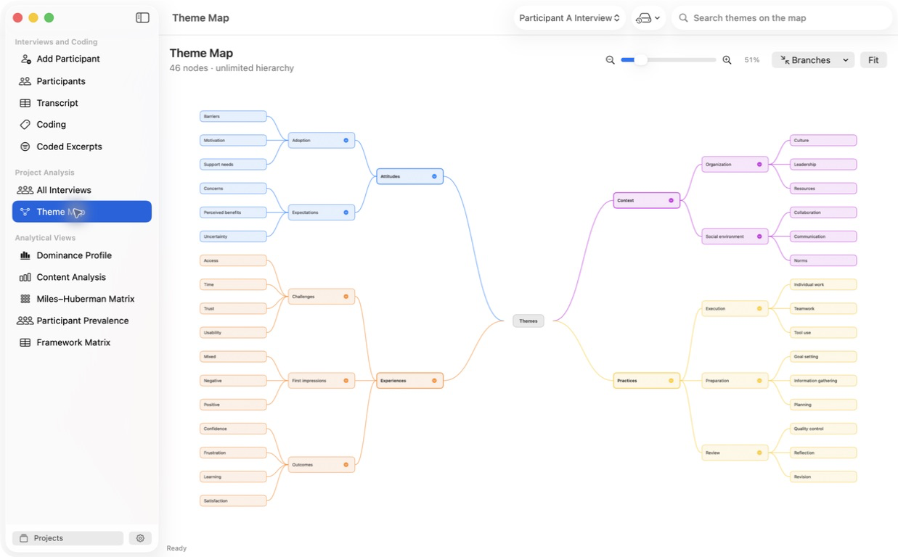

# Thematic Analysis for macOS

A native, local-first macOS application for organizing interview transcripts,
coding qualitative data, developing hierarchical themes, and comparing findings
across participants.

## Highlights

- Manage multiple research projects, interviews, and participant profiles.
- Import and edit XLSX, CSV, and TSV transcripts in a spreadsheet-style table.
- Transcribe audio with timestamps and speaker diarization through OpenAI's
  `gpt-4o-transcribe-diarize` model.
- Resize columns, merge consecutive rows, delete rows, and export transcripts to Excel.
- Assign multiple theme paths of unlimited depth to the same excerpt.
- Search, filter, review, and export coded excerpts.
- Explore a collapsible theme map with linked evidence and analytic notes.
- Compare cases using dominance, content analysis, Miles–Huberman,
  participant prevalence, and Framework Matrix views.
- Create and restore complete project backups.

## Built-in demo

Choose **Try Demo Project** on the project screen to create an editable,
synthetic example. It contains one short interview, five coded excerpts, and
an eleven-node hierarchy with themes, subthemes, and third-level themes.
Regular new projects still start completely empty.

## Screenshots

### Project library



### Coding workspace



### Theme map



## Privacy

The application is designed to keep research data under the user's control:

- Projects and imported transcripts are stored locally on the Mac.
- Audio is sent to OpenAI only when the user explicitly starts transcription.
- The OpenAI API key is stored in the macOS Keychain and is not included in
  projects, backups, logs, or this repository.
- This repository contains only synthetic sample content. It does not include
  interview recordings, research transcripts, participant details, API keys,
  or other personal data.

Researchers remain responsible for informed consent, lawful processing,
de-identification, secure storage, and any institutional requirements that
apply to their data.

## Requirements

- macOS 14 or later
- Swift 6 toolchain
- An OpenAI API key only when audio transcription is used

## Build and run

```sh
./script/build_and_run.sh
```

The script builds the Swift package, stages a native `.app` bundle under
`dist/`, and launches it.

Run the test suite with:

```sh
swift test
```

## Data files

The application stores its project library in the user's Application Support
directory. Project backups are portable ZIP or JSON artifacts that can be
opened from the project library.

## Contributing

Issues and pull requests are welcome. Please use synthetic or fully
de-identified data in bug reports, fixtures, screenshots, and tests.

## License

This project is available under the [MIT License](LICENSE). You may use,
modify, distribute, and include it in private or commercial projects under the
license terms.
