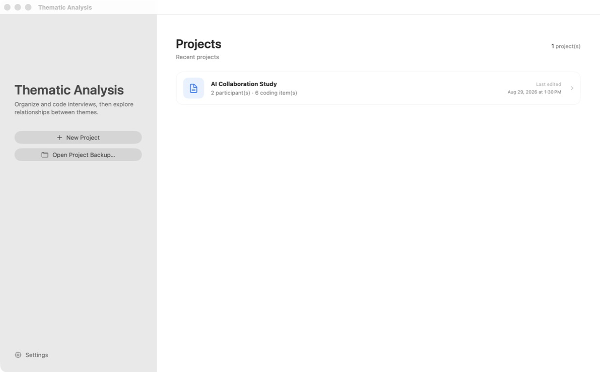
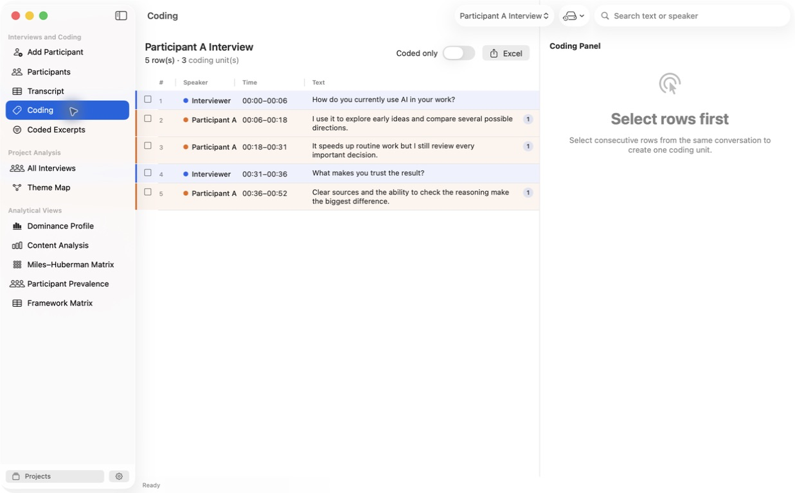
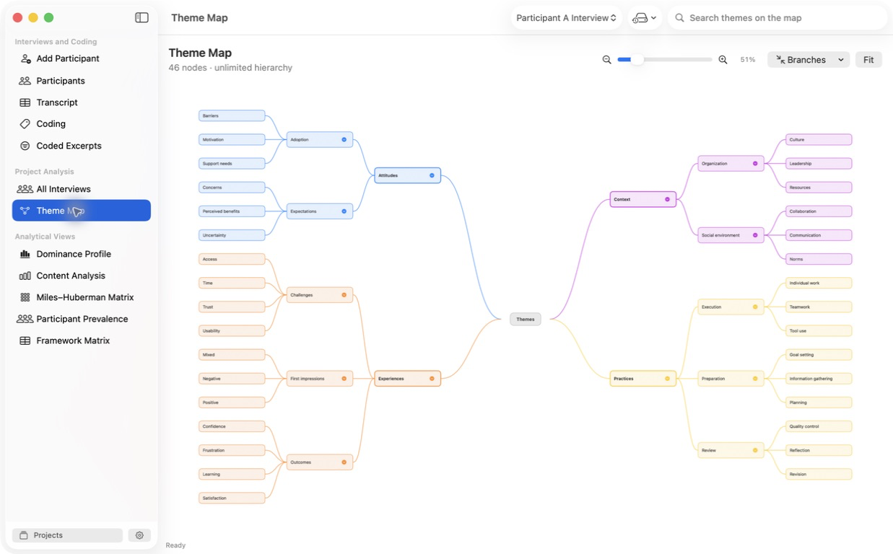

# Thematic Analysis for macOS

A native, local-first macOS application for organizing interview transcripts,
coding qualitative data, developing hierarchical themes, and comparing findings
across participants.
The interface can be switched between English and Turkish from Settings.

## Highlights

- Manage multiple research projects, interviews, and participant profiles.
- Import and edit XLSX, CSV, and TSV transcripts in a spreadsheet-style table.
- Transcribe audio with timestamps and speaker diarization through OpenAI's
  `gpt-4o-transcribe-diarize` model.
- Resize columns, merge consecutive rows, delete rows, and export transcripts to Excel.
- Assign multiple theme paths of unlimited depth to the same excerpt.
- Search, filter, review, and export coded excerpts.
- Explore a collapsible theme map with linked evidence and analytic notes.
- Compare cases using dominance, content analysis, Miles–Huberman,
  participant prevalence, and Framework Matrix views.
- Ask an evidence-linked AI analysis assistant questions using method-neutral,
  reflexive, codebook, framework, or coding-reliability profiles. Responses
  retain model and prompt provenance, reject unknown evidence IDs, and can be
  saved as Markdown memos with an audit trail.
- Define a project analysis brief, data scope, theme or interview focus, and
  surrounding transcript context from the dedicated Context workspace.
- Continue from clickable follow-up questions and record each AI response as
  accepted, needing revision, or rejected without converting it into a human
  analytic decision automatically.
- Create and restore complete project backups.

## Latest update — October 5, 2026

- The native app now launches in English by default, including a one-time
  migration for earlier installations that inherited the Turkish default.
- Dynamic labels and status text now use the selected app language reliably;
  this also fixes previously untranslated states such as **No file selected**.
- The Project Library has a redesigned empty state with clear actions for
  creating a study or opening a backup, plus a local-storage privacy cue.
- Legacy default project names are migrated from **Yeni Tematik Analiz** to
  **Untitled Project** without changing researcher-authored project names.
- Additional analysis, context, codebook, journal, and reporting labels were
  audited for consistent English and Turkish presentation.

## Built-in demo

The project library includes an editable **Demo — AI-Assisted Work** project
made entirely from synthetic data. It contains one short interview, five coded
excerpts, and an eleven-node hierarchy with themes, subthemes, and third-level
themes. Regular new projects still start completely empty.

## Screenshots

### Project library



### Coding workspace



### Theme map



## Privacy

The application is designed to keep research data under the user's control:

- Projects and imported transcripts are stored locally on the Mac.
- Audio is sent to OpenAI only when the user explicitly starts transcription.
- Project themes, coded excerpts, memos, and explicitly attached files are sent
  to OpenAI only when the user submits a question to the analysis assistant.
- The OpenAI API key is stored in the macOS Keychain and is not included in
  projects, backups, logs, or this repository.
- This repository contains only synthetic sample content. It does not include
  interview recordings, research transcripts, participant details, API keys,
  or other personal data.

Researchers remain responsible for informed consent, lawful processing,
de-identification, secure storage, and any institutional requirements that
apply to their data.

## Requirements

- macOS 14 or later
- Swift 6 toolchain
- An OpenAI API key only when audio transcription or the analysis assistant is used

## Build and run

```sh
./script/build_and_run.sh
```

The script builds the Swift package, stages a native `.app` bundle under
`dist/`, and launches it.

Run the test suite with:

```sh
swift test
```

## Web version

The browser version lives in `web/`. It is a TypeScript/React client using the
same JSON project schema as the native application. Projects are stored as
independent, versioned IndexedDB records and can open native JSON/ZIP backups.
It includes transcript import, speaker mapping, multi-theme coding and memos,
data-derived analytics, an evidence-linked theme map, XLSX export, dark
appearance, and responsive layouts.

```sh
cd web
npm install
npm run dev
```

On macOS, the local web gateway can use the OpenAI API key saved by the native
app. On other hosts, start it with `OPENAI_API_KEY` set in the server
environment. The browser never receives the key. Run all web checks with
`npm run check`.

The local-first architecture and credential boundary are documented in
[`web/docs/ADR-001-local-first-web.md`](web/docs/ADR-001-local-first-web.md).

## Language

Open **Settings → Language** and choose **English** or **Türkçe**. Existing
participant names, transcript text, project names, and researcher-authored
theme names remain unchanged because they are research data rather than
interface copy.

## Data files

The application stores its project library in the user's Application Support
directory. Project backups are portable ZIP or JSON artifacts that can be
opened from the project library.

## Contributing

Issues and pull requests are welcome. Please use synthetic or fully
de-identified data in bug reports, fixtures, screenshots, and tests.

## License

This project is available under the [MIT License](LICENSE). You may use,
modify, distribute, and include it in private or commercial projects under the
license terms.
